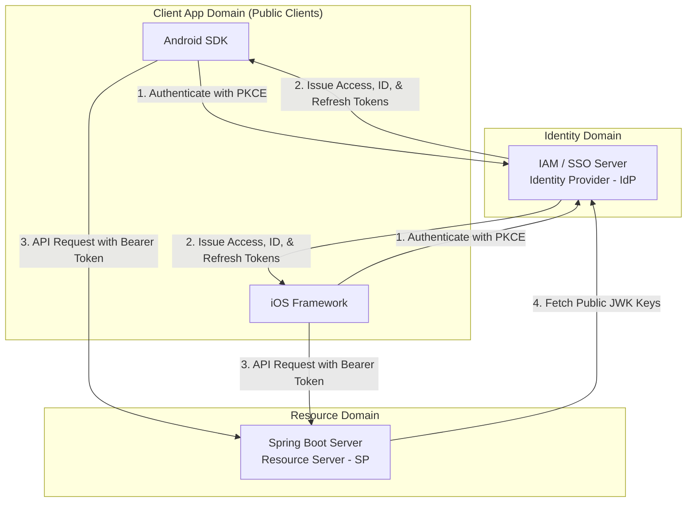

# Target Architecture & Interaction Guide (v2)

This document defines the architectural responsibilities and high-level interactions of the three target software components in the Custom SSO and IAM ecosystem: the **Spring Boot Server**, the **Android SDK**, and the **iOS Framework**.

---

## 1. Component Responsibilities

### Spring Boot Server (Resource Server)
The Spring Boot Server operates strictly as a stateless **Resource Server** (Service Provider) [1]. It does not manage user credentials or session states directly, relying instead on the central IAM (Identity Provider) server [1].

*   **Stateless Token Validation**: Intercepts inbound HTTP requests and validates the cryptographic signature of the **Access Token (JWT)** [1] against the IAM server’s public keys (retrieved via JSON Web Key Sets - JWKS).
*   **RBAC Enforcement**: Parses JWT **Claims** (e.g., user identifier `sub`, roles) to authorize user operations and enforce Role-Based Access Control (RBAC) [1].
*   **Scope Verification**: Validates that the requested **Scopes** matching the endpoint’s authorization requirements are present in the parsed token [1].
*   **API Security Filtering**: Rejects any request with an expired, malformed, or unsigned token with an `HTTP 401 Unauthorized` status.

### Android SDK (Native Mobile Client Library)
The Android SDK is a public client library designed to facilitate secure authentication, token management, and authenticated API requests on Android devices.

*   **PKCE Authentication Flow**: Executes the OIDC/OAuth 2.0 authorization code flow utilizing **Proof Key for Code Exchange (PKCE)** to prevent authorization code interception without a client secret [1].
*   **Secure Credential Storage**: Persists long-lived **Refresh Tokens** [1] using hardware-backed cryptography via the Android Keystore (e.g., `EncryptedSharedPreferences`).
*   **State & Session Management**: Tracks Access Token expiration and transparently handles token refresh requests to the IAM server without interrupting user sessions [1].
*   **UI Binding**: Decodes the **ID Token (JWT)** locally to expose user profile claims (e.g., email, display name) directly to the host application's UI [1].
*   **Network Interception**: Provides an HTTP interceptor (e.g., OkHttp Interceptor) to automatically append the **Access Token** as a `Bearer` token in the `Authorization` header of outgoing requests [1].

### iOS Framework (Native Mobile Client Library)
The iOS Framework provides mirroring capabilities of the Android SDK, built natively for iOS/iPadOS using Swift and Swift-specific system APIs.

*   **Secure OIDC Flows**: Uses `ASWebAuthenticationSession` to execute browser-based OIDC login flows with mandatory **PKCE** verification [1].
*   **Keychain Services Persistence**: Stores the high-value **Refresh Token** in the iOS Keychain [1], configured with strict accessibility parameters (e.g., `kSecAttrAccessibleAfterFirstUnlockThisDeviceOnly`).
*   **Local UI Context Extraction**: Parses and exposes claims inside the **ID Token** to native Swift/SwiftUI components for user profile displays [1].
*   **Thread-Safe Session Refreshing**: Implements thread-safe, non-blocking token renewal using Swift Concurrency (`async/await`) when expiring Access Tokens are detected.
*   **Automatic Header Enrichment**: Integrates with native networking stacks (e.g., `URLSession` delegate/protocols) to insert standard `Bearer` authorization tokens on designated domain routes [1].

---

## 2. High-Level Component Interactions

The native client SDKs operate as public clients, obtaining tokens directly from the IAM Server (IdP) and consuming resource APIs from the Spring Boot Server (Resource Server).

### High-Level Interaction Workflow:
1. **User Authentication**: The Android and iOS SDKs initiate a secure browser-based login flow with **PKCE** against the custom IAM server to authenticate the user and exchange authorization codes for cryptographic tokens [1].
2. **Token Lifecycle**: The SDKs receive and securely store the issued **Access, ID, and Refresh tokens** [1].
3. **API Requests**: When consuming endpoints, the SDKs automatically attach the **Access Token** to the authorization header of HTTP requests sent to the **Spring Boot Server** [1].
4. **Validation & Resolution**: The **Spring Boot Server** dynamically retrieves public key structures (JWKS) from the IAM server to validate the token's cryptographic signature and process the request statelessly [1].
